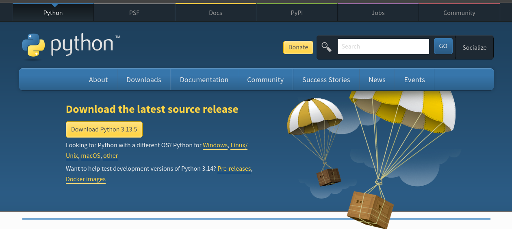

Rodrigo Esteves de Lima Lopes \
[IEL](http://www.iel.unicamp.br)/[UNICAMP](https://www.unicamp.br/unicamp/)\
[rll307@unicamp.br](mailto:rll307@unicamp.br)

# Installing Python

[Python](https://www.python.org/) is a powerful multi-proposal and high-level programming language, as `R`, it is open source and fairly semantic. Sometimes, we will use `Python` either to perform tasks that R does not handle so well, or to benefit from some functions which are not present in R.



## Download Python

[Python](https://www.python.org/) website and download the latest version to your computer. There are binary versions for macOS, Linux and Windows. I do not have a Windows computer since 1999, so probably I will not be able to help you much if there is a Windows-specific issue.

Next step is to install pip, and important tool to install packages in virtual environments. Type in windows

```python
py -m ensurepip --upgrade
```


