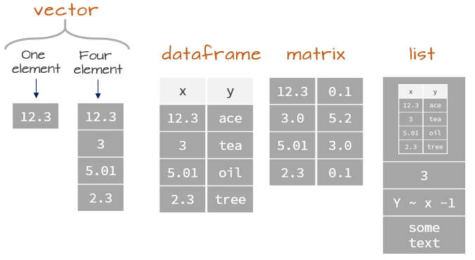

"Basic concepts with R (part 5)"

Rodrigo Esteves de Lima Lopes \
*Campinas State University* \
[rll307@unicamp.br](mailto:rll307@unicamp.br)

# Introduction

In this tutorial we are going to discuss the one more basic data structure in **R**: lists. I left them to the end because they are the ones I use less frequently in my search. However, they might be important to some packages that use such data structure during their processing. 

# Lists

Lists are **R**'s Swiss knife for data storage and I like to think it as a "meta" data storage facility. In formal terms, a list is an object that can *contain* other objects inside it. The idea is it to serve as an inventory of data, regarding a project or a specific data analysis. The image bellow compares the types of elements we have discussed so far:



Let us see it in practical terms. Firstly, Let us create a data frame:


```r
names <- c('Astolfo', "Eleutério", "Alarico", "Genésia","Gioconda","Ondina")
birthdays <-as.Date(c("1907-06-22","1987-07-12","1941-11-10",
                      "1940-11-15","1910-07-03","1982-06-21"))
gender <- c("male","male",'male', "female","female","female")
life.status <- c(FALSE,TRUE,FALSE,TRUE,FALSE,TRUE)
possible.age <- c(18,38, 84,80,115,43)
my.data.frame <- data.frame(names,birthdays,gender,life.status,possible.age)
colnames(my.data.frame) <- c("Names", 'Birthdays',"Gender","Life.Status",
                            "Possible.Age")
```


Secondly, we create a vector:


```r
my.vector <- c("b","r","a","s","i","l")
my.vector
```

```
## [1] "b" "r" "a" "s" "i" "l"
```

Then a set of single variables:


```r
y <- 2.5
professor <- "Rodrigo"
```

And, finally a couple of matrices:


```r
columns.names <- c('col1','col2', 'col3')
rows.names <- c('row1','row2','row3','row4','row5')
My.Matrix <- matrix(c(1:15), nrow = 5, byrow = TRUE, dimnames = list(rows.names, columns.names))
columns.names <- c('col1','col2', 'col3')
rows.names <- c('row1','row2','row3','row4','row5')
My.Matrix2 <- matrix(c(15:29), nrow = 5, byrow = TRUE, dimnames = list(rows.names, columns.names))
```


Now let us make a list:


```r
My.list <- list(my.vector,My.Matrix,My.Matrix2,professor,y,my.data.frame)
My.list
```

```
## [[1]]
## [1] "b" "r" "a" "s" "i" "l"
## 
## [[2]]
##      col1 col2 col3
## row1    1    2    3
## row2    4    5    6
## row3    7    8    9
## row4   10   11   12
## row5   13   14   15
## 
## [[3]]
##      col1 col2 col3
## row1   15   16   17
## row2   18   19   20
## row3   21   22   23
## row4   24   25   26
## row5   27   28   29
## 
## [[4]]
## [1] "Rodrigo"
## 
## [[5]]
## [1] 2.5
## 
## [[6]]
##       Names  Birthdays Gender Life.Status Possible.Age
## 1   Astolfo 1907-06-22   male       FALSE          118
## 2 Eleutério 1987-07-12   male        TRUE           38
## 3   Alarico 1941-11-10   male       FALSE           84
## 4   Genésia 1940-11-15 female        TRUE           85
## 5  Gioconda 1910-07-03 female       FALSE          115
## 6    Ondina 1982-06-21 female        TRUE           43
```

As we print `my.list` in the console or use the data viewer to have a pic on it, we will see that our data represented as an element of such a list. As any other data we can access, rename, and extract from a list. 

## Renaming list elements

Our first strategy is to associate a vector to the list's elements, as we do in any other data format:


```r
names(My.list) <- c('my.vector','My.Matrix','My.Matrix2','professor','y','my.data.frame')
My.list
```

```
## $my.vector
## [1] "b" "r" "a" "s" "i" "l"
## 
## $My.Matrix
##      col1 col2 col3
## row1    1    2    3
## row2    4    5    6
## row3    7    8    9
## row4   10   11   12
## row5   13   14   15
## 
## $My.Matrix2
##      col1 col2 col3
## row1   15   16   17
## row2   18   19   20
## row3   21   22   23
## row4   24   25   26
## row5   27   28   29
## 
## $professor
## [1] "Rodrigo"
## 
## $y
## [1] 2.5
## 
## $my.data.frame
##       Names  Birthdays Gender Life.Status Possible.Age
## 1   Astolfo 1907-06-22   male       FALSE          113
## 2 Eleutério 1987-07-12   male        TRUE           33
## 3   Alarico 1941-11-10   male       FALSE           79
## 4   Genésia 1940-11-15 female        TRUE           80
## 5  Gioconda 1910-07-03 female       FALSE          110
## 6    Ondina 1982-06-21 female        TRUE           38
```

## Deleting elements in a list

Simple, we delete it as a column in a data frame:

```r
My.list[6] <- NULL
My.list
```

```
## $my.vector
## [1] "b" "r" "a" "s" "i" "l"
## 
## $My.Matrix
##      col1 col2 col3
## row1    1    2    3
## row2    4    5    6
## row3    7    8    9
## row4   10   11   12
## row5   13   14   15
## 
## $My.Matrix2
##      col1 col2 col3
## row1   15   16   17
## row2   18   19   20
## row3   21   22   23
## row4   24   25   26
## row5   27   28   29
## 
## $professor
## [1] "Rodrigo"
## 
## $y
## [1] 2.5
```

## Extracting elements from a list. 

We can pull an element and send it to another variable:


```r
My.Matrix3 <- My.list[["My.Matrix2"]]
My.Matrix3
```

```
##      col1 col2 col3
## row1   15   16   17
## row2   18   19   20
## row3   21   22   23
## row4   24   25   26
## row5   27   28   29
```

Note that it does not delete the data inside the list, only copies it to a new variable. 


