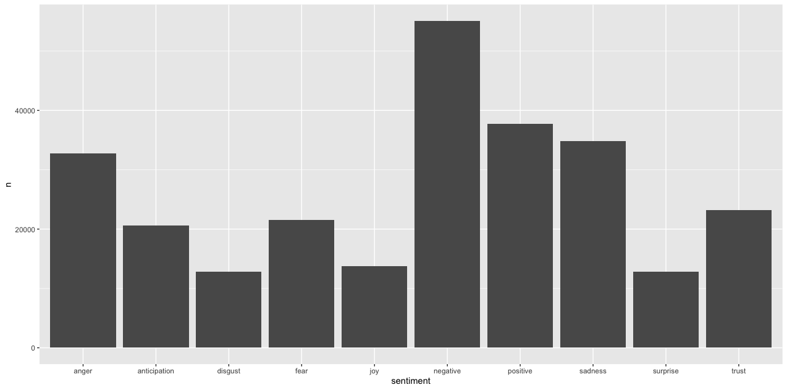
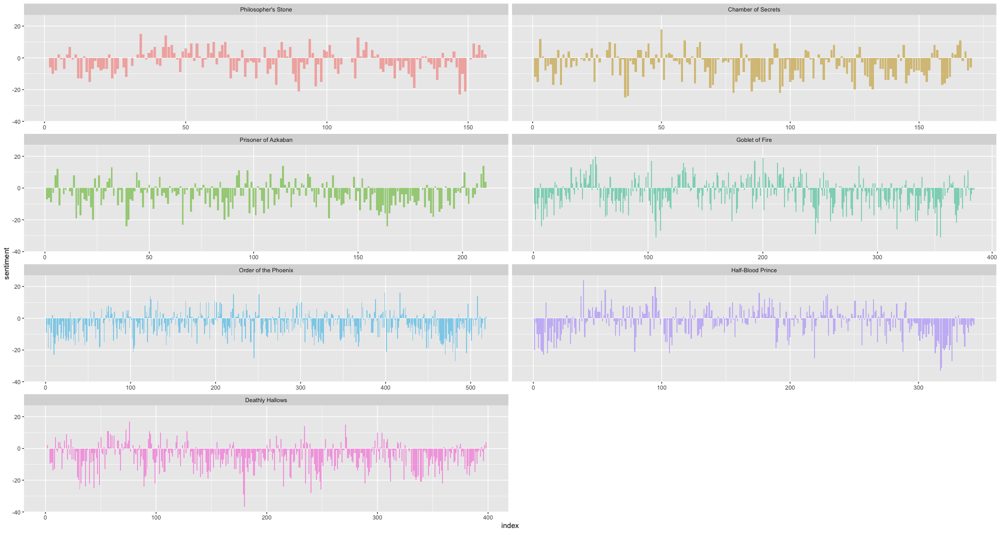
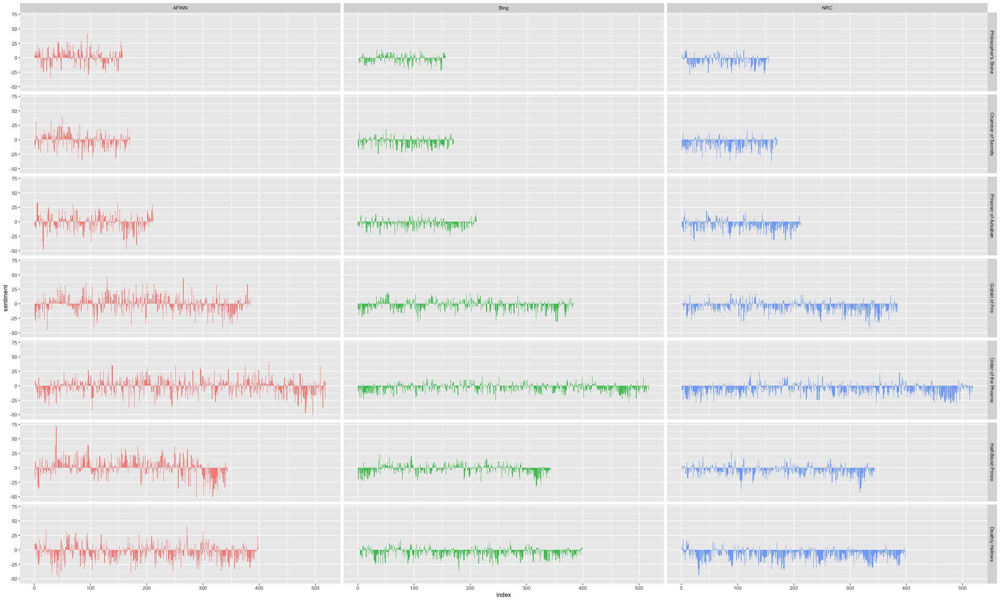
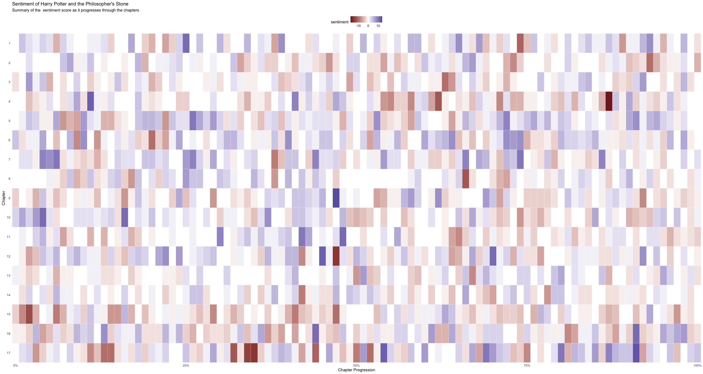

Rodrigo Esteves de Lima Lopes\
*Campinas State University*\
[rll307\@unicamp.br](mailto:rll307@unicamp.br)

# Harry Potter replication using TidyText

# Introduction

In this post I am going to discuss some strategies of comparison between texts and sentiment analysis. It was produced in order to assist colleagues who work in the area of Corpus Linguistics and Systemic Functional Linguistics, as a way to use R in their research. I think that sentiment analysis is an area which needs much work and is disregarded by linguistics. I hope it is a beginning. This is part of my CNPq-funded project and seeks to make corpus tools and network analysis accessible. If you have any doubts or wish to make any research contact please send me an email.

This document is based in the post by Bradley Boehmke and the UC R Programming Blog available [here](https://uc-r.github.io/sentiment_analysis?utm_source=pocket_mylist). I have done some very small changes to adapt it for my grad students.

# Harry Potter and sentiment analysis

We are going to study some sentiment analysis using R in some of Harry Potter novels. I personally think that sentiment analysis is an area of NLP and corpus analysis that should receive a bit more attention from Applied Linguistics. All sentiment data sets we are using here do not follow the framework of any linguistics theory. I hope it is a start for it.

The data is provided by the package [Happy Potter](https://github.com/bradleyboehmke/harrypotter). The three lexicons we are going to use in this tutorial are:

-   [AFINN](http://www2.imm.dtu.dk/pubdb/pubs/6010-full.html) by Finn Årup Nielsen
-   [bing](https://www.cs.uic.edu/~liub/FBS/sentiment-analysis.html) by Bing Liu and collaborators
-   [nrc](http://saifmohammad.com/WebPages/NRC-Emotion-Lexicon.htm) by Saif Mohammad and Peter Turney

# Packages

## Instaling special packages

We are installing an unofficial package so we have to install `devtools` first

``` {.r}
install.packages("devtools")
install.packages("textdata") 
```

Then to install our unofficial package directly from Github:

``` {.r}
devtools::install_github("bradleyboehmke/harrypotter")
```

## Loading Packages

If you do not have one of these, please install them using common package installation procedures. The comments tell us what each package is meant for

``` {.r}
library(tidyverse)      # Data manipulation
library(stringr)        # Regular expressions and text cleaning
library(tidytext)       # Text mining 
library(harrypotter) 
library(textdata)   # Our data
```

## Get sentiments using TidyText

Textdata helps us to download the lexicon from the internet. Here we are going to save each as a tibble:

``` {.r}
get_sentiments("afinn") |>
  as_tibble() |>
  head()
```

    ## # A tibble: 6 x 2
    ##   word       value
    ##   <chr>      <dbl>
    ## 1 abandon       -2
    ## 2 abandoned     -2
    ## 3 abandons      -2
    ## 4 abducted      -2
    ## 5 abduction     -2
    ## 6 abductions    -2

``` {.r}
get_sentiments("bing") |>
  as_tibble() |>
  head()
```

    ## # A tibble: 6 x 2
    ##   word       sentiment
    ##   <chr>      <chr>    
    ## 1 2-faces    negative 
    ## 2 abnormal   negative 
    ## 3 abolish    negative 
    ## 4 abominable negative 
    ## 5 abominably negative 
    ## 6 abominate  negative

``` {.r}
get_sentiments("nrc") |>
  as_tibble() |>
  head()
```

    ## # A tibble: 6 x 2
    ##   word      sentiment
    ##   <chr>     <chr>    
    ## 1 abacus    trust    
    ## 2 abandon   fear     
    ## 3 abandon   negative 
    ## 4 abandon   sadness  
    ## 5 abandoned anger    
    ## 6 abandoned fear

-   [AFINN](http://www2.imm.dtu.dk/pubdb/pubs/6010-full.html) is scale based, from -5 to 5
-   [bing](https://www.cs.uic.edu/~liub/FBS/sentiment-analysis.html) classifies words in a binary fashion (positive or negative)
-   [nrc](http://saifmohammad.com/WebPages/NRC-Emotion-Lexicon.htm) offers a more complex sentiment framework (trust, fear etc.)

This differences will be important when we perform the analysis later on.

# A Basic analysis

## Selecting data

Each book comes as a vector and each of its elements holds and entirer chapter

``` {.r}
CS <- chamber_of_secrets |>
  as_tibble()
```

Let us select the data creating a list of HP books, a vector with the titles and an empty data frame for latter use.

``` {.r}
titles <- c(
  "Philosopher's Stone",
  "Chamber of Secrets",
  "Prisoner of Azkaban",
  "Goblet of Fire",
  "Order of the Phoenix",
  "Half-Blood Prince",
  "Deathly Hallows"
)
books <- list(
  philosophers_stone,
  chamber_of_secrets,
  prisoner_of_azkaban,
  goblet_of_fire,
  order_of_the_phoenix,
  half_blood_prince,
  deathly_hallows
)
WL.Books <- tibble()
```

Now we are going to make a comprehensive wordlist, identifying which book which word is from.

``` {.r}
for (i in seq_along(titles)) {
  pre.list <- tibble(chapter = seq_along(books[[i]]),
                     text = books[[i]]) %>%
    unnest_tokens(word, text) %>%
    mutate(book = titles[i]) %>%
    select(book, everything())
  WL.Books <- rbind(WL.Books, pre.list)
}
```

Please note that for this process, we will use a `loop`, which creates a tibble (equivalent to a data frame, but not standard for all packages) with all words identified by book and chapter.

Now we are going to merge the sentiments from `nrc` and our data:

``` {.r}
Sentiment.Books <- WL.Books |>
  right_join(get_sentiments("nrc")) |>
  filter(!is.na(sentiment)) |>
  count(sentiment, sort = TRUE)
```

    ## Joining, by = "word"

``` {.r}
head(Sentiment.Books)
```

    ## # A tibble: 6 x 2
    ##   sentiment     n
    ##   <chr>     <int>
    ## 1 negative  55093
    ## 2 positive  37758
    ## 3 sadness   34878
    ## 4 anger     32743
    ## 5 trust     23154
    ## 6 fear      21536

Please note that we are using a different command `right_join`. It is provided by `dplyr/tidyverse` and is part of a set of new commands we should use:

-   inner_join()

    -   returns all rows from x where there are matching values in y, and all columns from x and y. If there are multiple matches between x and y, all combination of the matches are returned.

-   left_join()

    -   return all rows from x, and all columns from x and y. Rows in x with no match in y will have NA values in the new columns. If there are multiple matches between x and y, all combinations of the matches are returned.

-   right_join()

    -   return all rows from y, and all columns from x and y. Rows in y with no match in x will have NA values in the new columns. If there are multiple matches between x and y, all combinations of the matches are returned.

-   full_join()

    -   return all rows and all columns from both x and y. Where there are not matching values, returns NA for the one missing.

Please find more information at [Tidyverse website](https://dplyr.tidyverse.org/)

Now let us make our final plotting:

``` {.r}
ggplot2::ggplot(Sentiment.Books, aes(x = sentiment, y = n)) + 
  geom_bar(stat = "identity")
```

<!-- -->

# A first comparison

In this comparison, we need to create an index to each word and this index will be the word's position in the text. This is necessary why computers deal better with numbers, so we will make thinks easier for the processing. the comments in the following sequence tell us the history of text processing for comparing how the different sentiment lexicon perform in the Potter's Books.

``` {.r}
#Counting words and creating a an index
Word.Index <- WL.Books |>
  # Group words by book
  group_by(book) |>
  # Creates an index of 1000 words for the comparison to bee equal
  mutate(word_count = 1:n(),
         index = word_count %/% 500 + 1) 
```

``` {.r}
# joining with sentiments
Word.Index <- Word.Index |>
  # Joining by the words in common in bing
  inner_join(get_sentiments("bing")) 
```

    ## Joining, by = "word"

``` {.r}
#Counting sentiments and books
Word.Index <- Word.Index |>
  count(book, index = index , sentiment) |>
  ungroup() 
```

``` {.r}
# Spreading the sentiments
Word.Index <- Word.Index |>
  spread(sentiment, n)
```

``` {.r}
Word.Index <- Word.Index |>
  mutate(sentiment = positive - negative,
         book = factor(book, levels = titles))
```

Now in a single command (preferable and more elegant):

``` {.r}
Word.Index <- WL.Books |>
  group_by(book) |>
  mutate(word_count = 1:n(),
         index = word_count %/% 500 + 1) |>
  inner_join(get_sentiments("bing")) |>
  count(book, index = index , sentiment) |>
  ungroup() |>
  spread(sentiment, n) |>
  mutate(sentiment = positive - negative,
         book = factor(book, levels = titles))
```

    ## Joining, by = "word"

In the code above we:

1.  We created and index that breaks each book in 500 words unities. This help us to compare equal portions of texts in all novels.
2.  We joined the `bing` lexicon and associated each word and index to a sentiment in the lexicon. Words that were not in `bing` were not considered.
3.  We spread our data for processing
4.  We counted the positive and negative lexicons in order to consider the difference between them the sentiment of a 500 words unity

Now let us do some plotting:

``` {.r}
Word.Index |> 
  ggplot2::ggplot(aes(index, sentiment, fill = book)) +
  geom_bar(alpha = 0.5, stat = "identity", show.legend = FALSE) +
  facet_wrap(~ book, ncol = 2, scales = "free_x")
```

<!-- -->

# Comparing three sentiment packages

In order to compare how the different lexicon perform in the books we have to transform them in the same basis. All the variables have to be numerical in order to establish a baseline for all. In the code below, we do so.

First we count the positive and negative sentiments using `afinn`. Since `afinn` is already numerical, our job gets a bit easier:

``` {.r}
WI.afinn <- WL.Books |>
  group_by(book) |>
  mutate(word_count = 1:n(),
         index = word_count %/% 500 + 1) |>
  inner_join(get_sentiments("afinn")) |>
  group_by(book, index) |>
  summarise(sentiment = sum(value)) |>
  mutate(method = "AFINN")
```

    ## Joining, by = "word"

    ## `summarise()` has grouped output by 'book'. You can override using the `.groups` argument.

``` {.r}
WI.bing <- bind_rows(WL.Books |>
                       group_by(book) |>
                       mutate(word_count = 1:n(),
                              index = word_count %/% 500 + 1) |> 
                       inner_join(get_sentiments("bing")) |>
                       mutate(method = "Bing") |> 
                       count(book, method, index = index , sentiment) |>
                       ungroup() |>
                       spread(sentiment, n, fill = 0) |> 
                       mutate(sentiment = positive - negative) |>
                       select(book, index, method, sentiment)
                     )
```

    ## Joining, by = "word"

Our strategy on the code above was counting the positive and negative strings for the insertion of the sentiment column. For `nrc` we only chose the classification **positive** vs **negative** reducing its scope

``` {.r}
WI.NRC <- bind_rows(WL.Books |>
                      group_by(book) |>
                      mutate(word_count = 1:n(),
                             index = word_count %/% 500 + 1) |>
                      inner_join(get_sentiments("nrc") |>
                                   filter(sentiment %in% c("positive", "negative"))) |>
                      mutate(method = "NRC") |> 
                      count(book, method, index = index , sentiment) |>
                      ungroup() |>
                      spread(sentiment, n, fill = 0) |>
                      mutate(sentiment = positive - negative) |>
                      select(book, index, method, sentiment)
                    )
```

    ## Joining, by = "word"

Then we: 1) join the data frames and 2) plot them:

``` {.r}
final.sentiments <- bind_rows(WI.afinn, WI.bing,WI.NRC) |>
  ungroup() |>
  mutate(book = factor(book, levels = titles))

final.sentiments |> 
  ggplot2::ggplot(aes(index, sentiment, fill = method)) +
  geom_bar(alpha = 0.8, stat = "identity", show.legend = FALSE) +
  facet_grid(book ~ method)
```

<!-- -->

# Approaching sentences

In this approach we will get a single book and check the progression of the feelings though the book. we will keep on the indexing approach, now using the sentences as an indexing not pages. For this excercise, we are going to use the first Harry Potter's book. Let us organise our data by sentences and chapters

``` {.r}
#Organising by sentences and chapters
PS.sentences <- tibble(chapter = 1:length(philosophers_stone),
                       text = philosophers_stone) |> 
  unnest_tokens(sentence, text, token = "sentences")
```

Now we are going to:

1.  Index each sentence
2.  Index each word in the sentence
3.  Associate the sentiments to each word location
4.  Organise the resulting data frame

``` {.r}
PS.sentiments <- PS.sentences %>%
  #grouping by chapter 
  group_by(chapter) %>%
  #Creating the index
  mutate(sentence_num = 1:n(),
         index = round(sentence_num / n(), 2)) %>%
  #grouping by chapter and index
  group_by(chapter,index) %>%
  # Splitting the words and sentences
  unnest_tokens(word, sentence) %>%
  inner_join(get_sentiments("afinn")) %>%
  #Summarising the values
  summarise(sentiment = sum(value, na.rm = TRUE)) %>%
  #Organising
  arrange(desc(sentiment))
```

    ## Joining, by = "word"

    ## `summarise()` has grouped output by 'chapter'. You can override using the `.groups` argument.

Now we can do our final plot

``` {.r}
ggplot2::ggplot(PS.sentiments, aes(index, factor(chapter, levels = sort(unique(chapter), decreasing = TRUE)), fill = sentiment)) +
  geom_tile(color = "white") +
  scale_fill_gradient2() +
  scale_x_continuous(labels = scales::percent, expand = c(0, 0)) +
  scale_y_discrete(expand = c(0, 0)) +
  labs(x = "Chapter Progression", y = "Chapter") +
  ggtitle("Sentiment of Harry Potter and the Philosopher's Stone",
          subtitle = "Summary of the  sentiment score as it progresses through the chapters") +
  theme_minimal() +
  theme(panel.grid.major = element_blank(),
        panel.grid.minor = element_blank(),
        legend.position = "top")
```

<!-- -->
