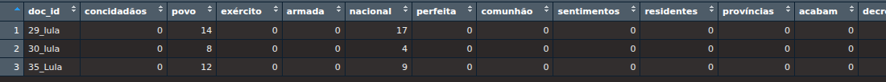
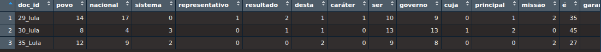
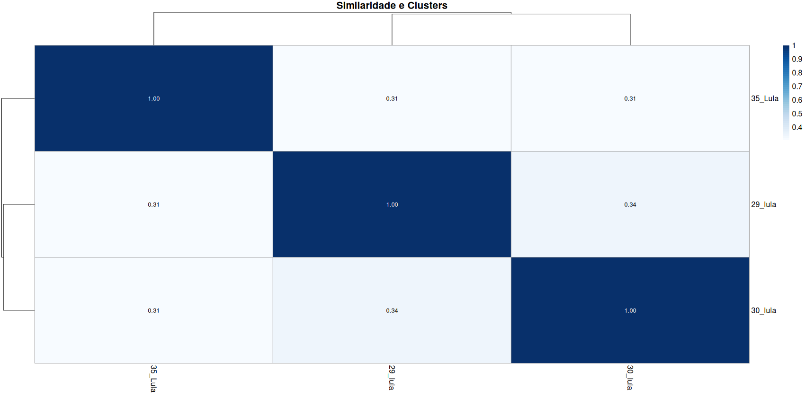
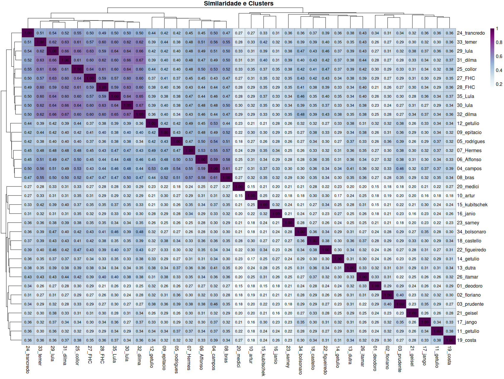
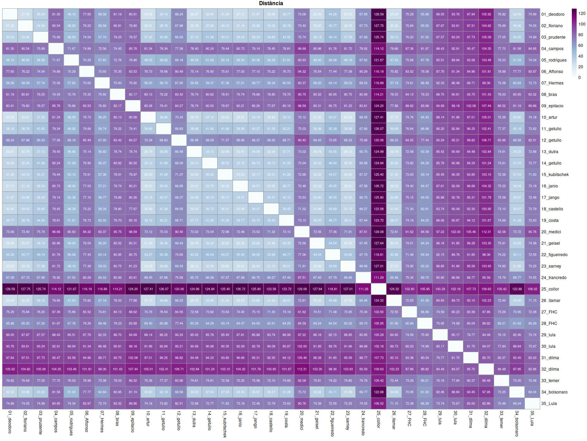

# Similarities and differences between texts

Rodrigo Esteves de Lima Lopes\
_Universidade Estadual de Campinas_
[rll307@unicamp.br](mailto:rll307@unicamp.br)

# Introduction

In this script, we will make a comparison amongst every the Inaugural Speeches delivered by all Brazilian presidents since the republic started.

# Packages

We are going to use some packages for analysing our data:

- **[Quanteda](https://quanteda.io/)**: Well known R package for corpus analysis
- **quanteda.textstats**: Part of Quanteda Family

# Similarity

First, we will load the packages and the downloading functions:

```r
library(BrPoliCorpus)
download_index()
library(quanteda)
library(quanteda.textstats)
library(pheatmap)
```
Now we download the inaugural speeches:

```r
DiscursosPresidetes <- download_InauguralSpeeches()
```

Now, let us create a corpus, and see some basic statistics

```r
Meu.corpus <- corpus(DiscursosPresidetes, docid_field = "doc_id", text_field = "text")
ndoc(Meu.corpus)
ntoken(Meu.corpus)
ntype(Meu.corpus)
nsentence(Meu.corpus)
```
The DFM will be the bases for our analysis:
```r
Meus.Tokens <- tokens(Meu.corpus, remove_punct = TRUE)
Minha.DFM <- dfm(Meus.Tokens) %>%
  dfm_remove(stopwords("portuguese"))
print(Minha.DFM)
```
A data frame will provide a better view:
```r
comparacao <- convert(Minha.DFM, to= 'data.frame')
View(comparacao)
```

Comparing all three texts from Lula's speeches:
```r
dfm_lula <- dfm_subset(Minha.DFM,
  subset = docnames(Minha.DFM) %in% c("29_lula", "30_lula", "35_Lula")
)
comparacao <- convert(dfm_lula, to = "data.frame")
```
If we have a look in this DFM, we will notice that there are some words counting zero in all documents. These words are there because `dfm_lula` came from larger data frame, where these words were present. I guess it is the time for us to clean it. 



```r
dfm_lula <- dfm_lula[, colSums(dfm_lula) > 0]
comparacao <- convert(dfm_lula, to = "data.frame")
```


It is time to compare how similar these texts are:

```r
similaridade <- textstat_simil(dfm_lula, method = "cosine", margin = "documents")
matriz_similaridade <- as.matrix(similaridade)
print(matriz_similaridade)
```


This similarity matrix is even more interesting if we print then. 


```r
cores_heatmap_2 <- colorRampPalette(brewer.pal(n = 9, name = "Blues"))(50)
cor_dos_numeros <- ifelse(matriz_similaridade > 0.5, "white", "black")
pheatmap(
  matriz_similaridade,
  main = "Similaridade e Clusters",
  display_numbers = TRUE,
  fontsize = 12,
  color = cores_heatmap_2,
  number_color = cor_dos_numeros
)
```


And if we compared the similarities of all speeches?

similaridade <- textstat_simil(Minha.DFM, method = "cosine", margin = "documents")
matriz_similaridade <- as.matrix(similaridade)
cores_heatmap <- colorRampPalette(brewer.pal(n = 10, name = "BuPu"))(50)
```r
pheatmap(
  matriz_similaridade,
  main = "Similaridade e Clusters",
  display_numbers = TRUE,
  fontsize = 12,
  color = cores_heatmap,
  number_color = "black"
)
```

# Differences

A good exercise is also comparing the differences between texts:

```r
distancia <- textstat_dist(Minha.DFM,
                           method = "euclidean",
                           margin = "documents")

pheatmap(
  distancia,
  main = "Distância",
  display_numbers = TRUE,
  fontsize = 9,
  color = cores_heatmap,
  number_color = "white",
  cluster_rows = FALSE,
  cluster_cols = FALSE,
)
```




