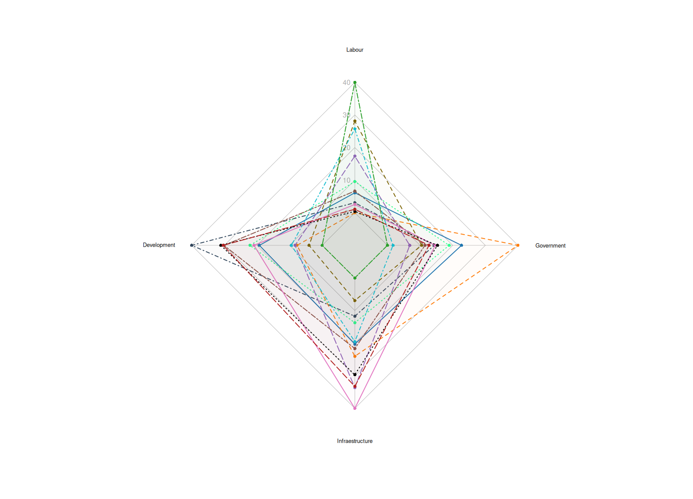

# Radar chart: Visualizing cluster performance by party


***

## Objective

The objective of this script (kept exactly as in the code) is to demonstrate how each party performa in the topics we just discussed.

This document explains every block of the R code provided, line-by-line, so you can publish the markdown on GitHub as an instructional `apostila` (tutorial). **I did not change a single line of the code you provided; the original script is included below.**


## Packages

Make sure you have R installed along with the following packages used by the script:

* `tibble` — manipulating data frames
* `dplyr` — data manipulation  (`select`, `mutate`, `arrange`, etc.)
* `fmsb` — provides the `radarchart()` function used to draw radar charts
* `tidyr` — (used implicitly in the script via `tidyr::separate`) for splitting columns

Install them in R if necessary, e.g.:

```r
install.packages(c("dplyr","fmsb","tidyr"))
```

> Note: The script references a function `clusters_by_doc_table()` and an object `My.corpus`. These are not base R functions and must come from your our previous scripot (please ensure those objects/functions are available in your environment before running the script).


## Analysing the data

Below I explain the purpose and effect of each important block in the script. Where a function is not a base function (for example, `clusters_by_doc_table()`), I explain expected input / output so you can integrate your own objects.

### 1) Loading libraries

```r
library(tibble)
library(dplyr)
library(fmsb)
```

* `tibble` — modern data frames with nicer printing and subsetting behavior.

* `dplyr` — used for piping (`%>%`) and data transformations such as `mutate()` and `select()`.

* `fmsb` — provides `radarchart()` used to draw the radar chart.

### 2) Producing `ClustersDoc`

```r
ClustersDoc <- clusters_by_doc_table(My.corpus,
  clust_var = "cluster", prop = TRUE
)
```

* **Assumed input:** `My.corpus` — a corpus or collection of documents. The helper function `clusters_by_doc_table()` likely computes, for each document, the proportion (since `prop = TRUE`) of content assigned to each cluster/topic. The script expects a `doc_id` column and a set of numeric `clust_*` columns.
* **Expected output:** a table/data.frame/tibble (`ClustersDoc`) with at least these columns: `doc_id` (formatted like `Party_Number`) and cluster proportion columns named beginning with `clust_` (e.g. `clust_1`, `clust_2`, and so on).


### 3) Splitting `doc_id` into `Party` and `Number`

```r
ClustersDoc <- ClustersDoc %>%
tidyr::separate(doc_id, into = c("Party", "Number"), sep = "_")
```

* This splits a single `doc_id` column which looks like `PARTY_1`, `PDT_2`, etc., into two columns: `Party` and `Number`. The separator used is an underscore `_`.
* After this step, `ClustersDoc` contains explicit `Party` and `Number` columns and no longer has `doc_id`.

### 4) Rounding cluster proportions
```r
ClustersDoc <- ClustersDoc %>%
mutate(across(starts_with("clust_"), ~ round(.x, 2)))
```
* `mutate()` combined with `across()` selects every column whose name starts with `clust_` and rounds its values to 2 decimal places.

* This keeps the proportions compact and better for display.

### 5) Renaming the cluster columns to meaningful topic labels

```r
colnames(ClustersDoc)[3] <- "Labour"
colnames(ClustersDoc)[4] <- "Development"
colnames(ClustersDoc)[5] <- "Infraestructure"
colnames(ClustersDoc)[6] <- "Government"
```
* These lines rename the third through sixth column names to readable labels used as radar axes later. Make sure the positions match your actual clustering columns — this script assumes the `Party` and `Number` columns are the first two columns and cluster columns follow.


### 6) Preparing the data frame for `radarchart()`

```r
df_for_radar <- ClustersDoc %>%
select(-Party, -Number) %>%
as.data.frame()

df_for_radar <- rbind(
apply(df_for_radar, 2, max),
apply(df_for_radar, 2, min),
df_for_radar
)
row.names(df_for_radar) <- c("max", "min", ClustersDoc$Party)
```
* `select(-Party, -Number)` removes the meta columns so only numeric columns (topic scores) remain.

* The `radarchart()` function from `fmsb` expects the first two rows of the data frame to be the maximum and minimum values for each axis. Therefore, the script prepends a `max` row and a `min` row using `apply(..., max)` and `apply(..., min)` across columns.

* Finally, `row.names()` assigns row names: the first two names are `"max"` and `"min"` and then each subsequent row is named after the `Party` value corresponding to that document.

### 7) Color mapping
```r
colors <- c(
"PDT" = "#1f77b4", # Blue
"DC" = "#ff7f0e", # Orange
"NOVO" = "#33ff90", # Green
"PL" = "#34495e",# Police Blue
"UP" = "#9467bd", # Purple
"PT" = "#8c564b", # Brown
"PROS" = "#e377c2", # Pink
"PTB" = "#7d6608", # Black
"MDB" = "black", # Yellow-green
"PCB" = "#17becf", # Cyan
"UNIÃO" = "#b22222",# Firebrick
"PSTU" = "#2ca02c" # Forest green
)
```
* This is a named character vector mapping party abbreviations to hexadecimal color codes. The script later indexes this vector with `ClustersDoc$Party` so each party gets a consistent color for the polygon stroke (`pcol`) and filling (`pfcol`).
* If your `ClustersDoc$Party` contains abbreviations not present here, indexing will produce `NA` colors and `radarchart()` will likely produce warnings or use defaults.

### 8) Plotting the radar chart

```r
radarchart(
df_for_radar,
axistype = 1,
pcol = colors[ClustersDoc$Party],
pfcol = adjustcolor(colors[ClustersDoc$Party], alpha.f = 0.02),
plwd = 2,
cglcol = "darkgrey",
cglty = 1,
axislabcol = "darkgrey",
caxislabels = seq(0, 50, 10),
cglwd = 0.8,
vlcex = 0.8
)
```

* `df_for_radar` is the data frame prepared previously.
* `axistype = 1` draws axis labels style (see `?fmsb` docs for alternatives).
* `pcol` sets the polygon border color for each party by selecting colors for each row via `colors[ClustersDoc$Party]`.
* `pfcol` sets fill color for the polygon. The call to `adjustcolor(..., alpha.f = 0.02)` makes fills  transparent (alpha = 0.02), so overlapping polygons remain visible.
* `plwd = 2` sets polygon border width.
* `cglcol`, `cglty`, `cglwd` control the radial grid (circle/lines) color, line type and width.
* `axislabcol` controls the color of axis labels.
* `caxislabels = seq(0, 50, 10)` shows axis labels 0, 10, 20, 30, 40, 50. These should match the scale of your topic values. If your proportions range 0..1, consider changing these labels or scaling your data.
* `vlcex = 0.8` changes the size of the variable label text (the labels around the radar: `Labour`, `Development`, etc.).

### 9) Adding a legend

```r
legend(
"bottomleft",
legend = ClustersDoc$Party,
col = colors[ClustersDoc$Party],
pch = 20,
bty = "n",
pt.cex = 3.5,
cex = 1,
text.col = "black",
horiz = FALSE
)
```
* Places a legend at the `bottomleft` of the plotting area.
* `legend` entries are the party names found in `ClustersDoc$Party`.
* `col` sets the point color to the same party color mapping.
* `pch = 20` draws solid circle symbols in the legend; `pt.cex` controls their size.
* `bty = "n"` removes the legend box border.



